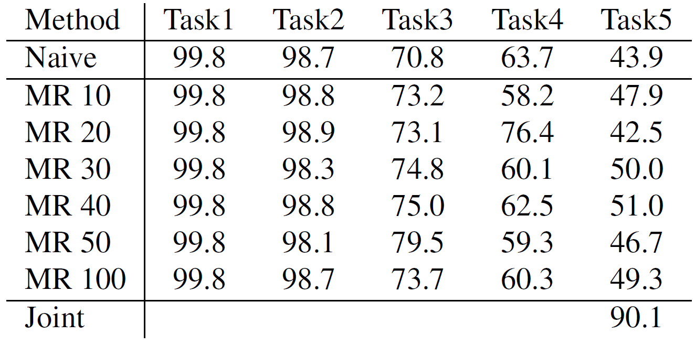
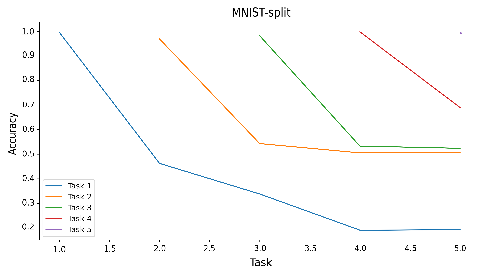
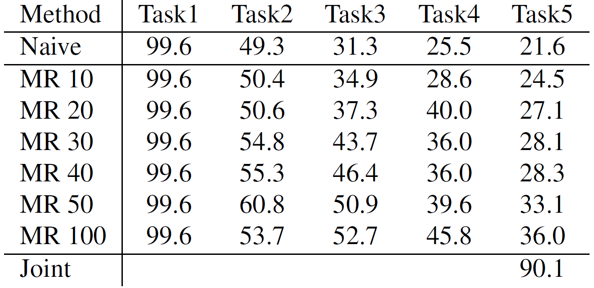

# Neuromorphic Computing Exam 2023

## Memory replay for continual learning with spiking neural networks

Two of the most impressive features of biological neural networks are their high energy efficiency and their ability to continuously
adapt to varying inputs. On the contrary, the amount of power required to train top-performing deep learning models rises as they become more complex. This is the main reason for the increasing research interest in spiking neural networks, which mimic the functioning of the human brain achieving similar performances to artificial neural networks, but with much lower energy costs. However, even this type of network is not provided with the ability to incrementally learn new tasks, with the main obstacle being catastrophic forgetting.

Herein, we whether memory replay is a good strategy to mitigate catastrophic forgetting in spiking neural networks. Despite their high memory
requirements, replay-based approaches have proved to significantly attenuate forgetting in artificial neural networks. Consequently, it is interesting to test whether they are effective also in the case of SNNs. Experiments are conducted on the MNIST-split dataset in both class-incremental learning and task-free continual learning scenarios.

All the code was developed in PyTorch using SNNTorch library.

### Continual learning scenarios
We consider the two most challenging continual learning scenarios:
    * Class-incremental learning - task ids are provided just during training.
    * Task-free continual learning - task ids are not provided during training or testing.

### Network architectures
We propose a different architecture for each of the two scenarios, but the initial convolutional part is the same for both of them. In particular, we use two convolutional layers of 12 and 64 5 × 5 filters, each followed by an instance of the Leaky class (that implements a first-order leaky integrate-and-fire neuron model) from the SNNTorch library, which integrates the output of the last convolutional layer over time, emitting a spike if the threshold condition is met. The β parameter, which is the membrane potential decay rate, is set to 0.99. Since the output of LIF neurons is a spike if the threshold is reached and 0 otherwise, such output S can be modeled as an Heaviside step function, which is non-differentiable. Consequently, in order to train one such model with backpropagation, we need to use a smoothing surrogate function. The one we choose is the fast sigmoid function with slope set to the default value of 25.

Concerning the last part of the network for the class-incremental learning scenario, we implement a dynamic architecture. Specifically, every time we introduce a new task, a new linear layer with output dimension 2 is added, followed by an instance of SNNTorch Leaky. At training time, we return just the output of the head added for the task we are training on, in order to not interfere with the previously trained heads. At validation and testing times, instead, we do not provide the task index, so our model will return the concatenation of the outputs of all the heads and we will perform the classification over the total number of seen classes. For the task-free continual learning scenario, we simply use a linear layer with output dimension 10, followed by an instance of SNNTorch Leaky.

Both models are trained using cross entropy spike count loss implemented in the SNNTorch library. This function first accumulates the spikes at each timestep and then applies the cross entropy loss function, thus encouraging the correct class to fire at all time steps while suppressing incorrect classes from firing. As optimizer, we used Adam. The type of surrogate function and the hyperparameters can be changed in the configuration files in the /config/ folder.

### Dataset
All experiments are conducted on the MNIST dataset, which is split in 5 different binary classification tasks, such that task 1 contains digits 0 and 1, task 2 contains digits 2 and 3, and so on.

### Results
#### Class-incremental learning
This table shows the results on the class-incremental learning scenario. As a baseline, we report the accuracy results obtained using naive finetuning, which consists in training the network sequentially on the different tasks without any accouterments. This type of training leads to a final average accuracy on all tasks equal to 43.9%. Then, we report the results obtained by storing 10, 20, 30, 40, 50, and 100 batches of data for each task. It can be seen that without imposing any kind of regularization, storing a larger number of samples per task is not always beneficial. In particular, the highest final accuracy of 51% is reached by storing 40 batches per task. Instead, by storing 100 batches per task theperformance decreases by 1.7%. Overall, using experience replay we are able to reduce the accuracy drop by at most 7.1%, which is a significant improvement considering that it was achieved without using any form of regularization. The results obtained with a joint training on all tasks are reported as an upper bound.

The next figure shows the evolution of the accuracy on each task as the number of tasks grows. The performance on the last trained task is always significantly high, close to 100%. After training the network on task i, the accuracy on task i − 1 drops, reaching values around 50%, for i = 2, 3, 4. Instead, after training on task 5, the accuracy on task 4 remains slightly higher, at around 70%.

#### Task-free continual learning
The following table shows the results obtained for the task-free continual learning scenario. Again, we use as a baseline the naive finetuning, which achieves a final average accuracy over all the tasks of 21.6%. In this scenario, the reduction in accuracy drop registered is more notable than in the class-incremental learning scenario, obtaining 36% of accuracy by storing 100 batches per task, which corresponds to an improvement by 14.4% with respect to naive finetuning. In this case, using a larger memory is more helpful in preventing forgetting. This may be due to the higher intrinsic complexity of this scenario. Nevertheless, even with half the memory (50 batches per task), we are able to improve the accuracy by more than 10%.

## How to run the code

To train one of the networks with the setup specified in config_file.yaml, run:

`python train.py --config ./configs/config_file.yaml`

Then, to test the network you can run:

`python test.py --config ./configs/config_file.yaml`

To train and test the joint training (on the whole 10-class dataset):

`python joint_training.py`
